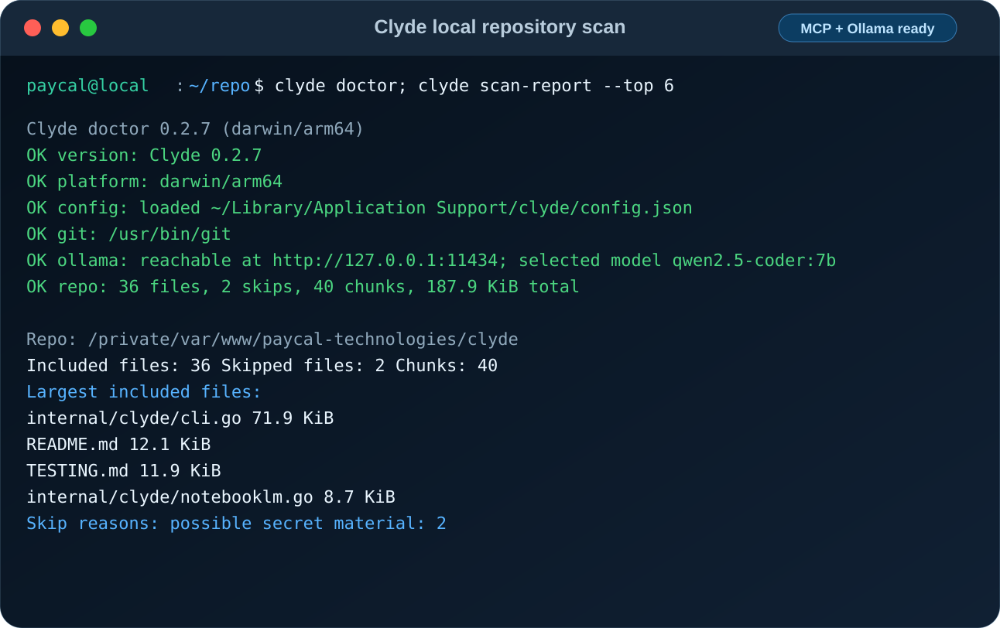

# Clyde

[](https://github.com/PayCal-Technologies/clyde/actions/workflows/test.yml)
[](https://github.com/PayCal-Technologies/clyde/releases)
[](LICENSE)
[](https://pkg.go.dev/github.com/PayCal-Technologies/clyde)
[](#install-from-source)

Clyde is a small Go MCP-client harness for moving auditable repository source bundles
into Google NotebookLM.

Current version: `1.0.0`

Official resources:

- Clyde homepage: [paycaltech.com/clyde](https://paycaltech.com/clyde)
- Clyde help: [paycaltech.com/clyde/help](https://paycaltech.com/clyde/help)
- GitHub: [github.com/PayCal-Technologies/clyde](https://github.com/PayCal-Technologies/clyde)
- Created by [PayCal Technologies](https://paycaltech.com)
- Examples: [`examples/`](examples/)
- Testing guide: [`TESTING.md`](TESTING.md)
- Contributing: [`CONTRIBUTING.md`](CONTRIBUTING.md)
- Security reports: [`SECURITY.md`](SECURITY.md)



It is intentionally conservative:

- `preview` reports what would be included or skipped.
- `bundle` writes private, digest-bound `manifest.json` and `chunks.jsonl` files for review.
- `bundle verify` validates the reviewed bundle before upload approval.
- `sync --bundle` uploads only after `--approve-upload` and `--approve-digest`.
- `sync --dry-run` checks the selected backend and prints the planned changes
  without uploading, deleting, or writing a receipt.
- Binary files, large files, common dependency/build directories, and likely
  secrets are skipped by default.
- The default NotebookLM backend is the pinned `notebooklm-mcp@2.0.0` MCP server
  over local stdio.

## Build

```bash
go build -o bin/clyde ./cmd/clyde
```

Run tests:

```bash
go test ./...
```

## Standard Release Procedure

Use this procedure for every Clyde release and performance pass:

1. Check `git status --short` first. Commit and push any unrelated pending work
   before starting a review.
2. Run a targeted Clyde-on-Clyde review, such as:

   ```bash
   clyde agent . \
     --include "internal/**/*.go" \
     --include "cmd/**/*.go" \
     --include "README.md" \
     --include "CHANGELOG.md" \
     "Performance review for Clyde itself. Identify concrete optimizations worth implementing now."
   ```

3. Implement only concrete, testable improvements. Record rejected suggestions
   when they do not fit Clyde's CLI execution model.
4. Run `gofmt`, `go test ./...`, `go test -race ./internal/clyde`,
   `go vet ./...`, `go run ./cmd/clyde --about`, and
   `go run ./cmd/clyde help --json`.
5. Update `VERSION`, `productVersion`, `CHANGELOG.md`, and this README.
6. Commit, push, create an annotated version tag, and push the tag. The release
   workflow builds deterministic Linux, macOS, and Windows archives, verifies
   archive contents, publishes SHA-256 checksums, an SPDX-compatible SBOM, and
   Sigstore-signed SLSA provenance, then verifies published asset checksums.
7. Keep GitHub workflow changes local-only and repo-controlled. Before changing
   workflows, run `.github/scripts/check-github-policy.sh` and follow
   `.github/WORKFLOW_POLICY.md`.
8. Rebuild the local global install after the release when this workstation
   needs the new `clyde` binary.

## Install From Source

```bash
go install github.com/PayCal-Technologies/clyde/cmd/clyde@v1.0.0
```

Windows from source in PowerShell:

```powershell
go install github.com/PayCal-Technologies/clyde/cmd/clyde@v1.0.0
clyde --about
```

Clyde is portable Go and is intended to run on Windows, macOS, and Linux.
Repository previewing, bundling, local Ollama commands, the status daemon, and
NotebookLM sync use cross-platform Go APIs. Windows users still need local
dependencies for the commands they run, such as Git for fast repository file
discovery, Ollama for `ask` and `agent`, and Node/npm or `nlm` for NotebookLM
sync backends.

## Usage

Initialize Clyde's config file:

```bash
clyde config init
clyde config show
clyde help
clyde help agent
clyde help --json
clyde --about
clyde doctor
clyde scan-report .
```

Generate shell completion:

```bash
clyde completion zsh > /opt/homebrew/share/zsh/site-functions/_clyde
clyde completion bash > ~/.clyde-completion.bash
clyde completion fish > ~/.config/fish/completions/clyde.fish
```

PowerShell completion can be loaded for the current session:

```powershell
clyde completion powershell | Out-String | Invoke-Expression
```

To make PowerShell completion persistent, add that line to `$PROFILE`.

Additional completion targets are available for users of smaller shells and
Windows command-line enhancers:

| Shell | Command |
| --- | --- |
| Elvish | `clyde completion elvish > ~/.elvish/completions/clyde.elv` |
| Nushell | `clyde completion nushell > clyde-completions.nu` |
| Xonsh | `clyde completion xonsh > ~/.xonshrc.d/clyde-completions.xsh` |
| Tcsh | `clyde completion tcsh >> ~/.tcshrc` |
| Clink | `clyde completion clink > %LOCALAPPDATA%\\clink\\clyde.lua` |
| Yash | `clyde completion yash >> ~/.yashrc` |
| Oil/OSH/YSH | `clyde completion oil > ~/.config/oils/clyde-completions.sh` |

Help surfaces are designed for both humans and automation:

- `clyde --help` prints concise human-readable top-level help.
- `clyde help COMMAND` prints command-specific help without requiring a valid
  local config file.
- `clyde help --json` prints a structured command catalog with command names,
  categories, summaries, access level, network behavior, syntax, and examples.
- `clyde --about` and `clyde about` print product links for the official
  homepage, help site, GitHub repository, and PayCal Technologies.
- `clyde doctor` prints read-only environment diagnostics. Use
  `clyde doctor --json` or `clyde doctor /path/to/repo --json` for automation
  and AI-readable troubleshooting.

Doctor checks:

```bash
clyde doctor
clyde doctor /path/to/repo
clyde doctor /path/to/repo --json
```

The diagnostic report covers Clyde's version, OS/architecture, config file
status, PATH availability for Git, `npx`, and `nlm`, local Ollama reachability,
and optional repository scan readiness. It does not upload source or modify
local files.

Repository scan reports:

```bash
clyde scan-report /path/to/repo
clyde scan-report /path/to/repo --json
clyde scan-report /path/to/repo --include "internal/**/*.go" --top 20
```

`scan-report` is read-only and summarizes the shape of Clyde's repository scan:
included/skipped counts, chunk count, largest included files, extension counts,
skip reasons, and scan limits. Use the JSON form when an AI assistant or CI job
needs compact repository-shape context without creating a bundle or uploading
data.

By default Clyde reads `~/.config/clyde/config.json`. Set `CLYDE_CONFIG` to use
a different file. CLI flags override environment variables, environment
variables override the config file, and the config file overrides Clyde's built
in v0.2 defaults. A copyable example lives at `examples/config.json`.

Example config:

```json
{
  "ollama_url": "http://127.0.0.1:11434",
  "model": "qwen2.5-coder:7b",
  "num_ctx": 8192,
  "ask_timeout_seconds": 120,
  "agent_timeout_seconds": 180,
  "max_context_chars": 16000,
  "max_file_bytes": 250000,
  "max_chunk_chars": 18000
}
```

Configuration reference:

| Field | Purpose | Default |
| --- | --- | --- |
| `ollama_url` | Ollama API base URL. Must be `http` or `https` with a host. | `http://127.0.0.1:11434` |
| `model` | Preferred local Ollama model for `ask` and `agent`. | `qwen2.5-coder:7b` |
| `num_ctx` | Context window sent to Ollama generation requests. | `8192` |
| `ask_timeout_seconds` | Timeout for direct `ask` requests. | `120` |
| `agent_timeout_seconds` | Timeout for repo-scanning `agent` requests. | `180` |
| `max_context_chars` | Maximum direct prompt/context size Clyde will prepare. | `16000` |
| `max_file_bytes` | Per-file source scanning cap. | `250000` |
| `max_chunk_chars` | Source bundle chunk size for NotebookLM upload records. | `18000` |
| `exclude_folders` | Optional additional folder names or relative folder paths to skip during repository scans. Omit it for the basic behavior-only config. | none |

Omitted or zero numeric config values are replaced with defaults. String values
are trimmed. Negative numeric values, blank model names, NUL bytes, invalid
Ollama URLs, and oversized limits are rejected during config load.
`CLYDE_OLLAMA_URL` and `CLYDE_MODEL` override the file and are validated the
same way. `CLYDE_CONFIG` points Clyde at an alternate config file.

Preview a repo:

```bash
clyde preview /path/to/repo
```

Preview with tighter scope:

```bash
clyde preview /path/to/repo \
  --include "internal/**/*.go" \
  --exclude "testdata/**" \
  --exclude-folder "generated" \
  --max-file-bytes 100000 \
  --show-files 10 \
  --show-skips 25
```

Machine-readable preview:

```bash
clyde preview /path/to/repo --json
```

In Git repositories, Clyde uses `git ls-files -co --exclude-standard` from the
worktree root so `.gitignore` and standard Git exclusions are honored even when
you scan a subdirectory. If Git discovery fails, Clyde stops instead of falling
back to a raw filesystem walk. Use `--allow-filesystem-fallback` only when you
intentionally accept that `.gitignore` may not be honored. Raw filesystem
discovery fails closed if Clyde reaches its path ceiling.

Create a local bundle:

```bash
clyde bundle /path/to/repo --out .clyde/out
```

Require a dedicated secret scanner before writing a bundle:

```bash
clyde bundle /path/to/repo \
  --out .clyde/out \
  --require-secret-scan \
  --secret-scan-command "gitleaks detect --no-git --source {repo}"
```

`{repo}` and `{bundle}` expand to a private temporary snapshot of Clyde's
captured source bytes, not the live working tree. The manifest records the
scanner command plus target and output digests so the scan evidence is bound to
the reviewed bundle.

Verify the reviewed bundle and copy the printed digest into the upload command:

```bash
clyde bundle verify .clyde/out
```

Plan a dated NotebookLM book name:

```bash
clyde book "Clyde self feedback"
```

List local Ollama models:

```bash
clyde models
clyde models --json
```

Ask the selected local model directly:

```bash
clyde ask --model qwen2.5-coder:7b "Review this function for edge cases"
```

Longer prompts can be passed through a file or stdin:

```bash
clyde ask --model qwen2.5-coder:7b --prompt-file prompt.md
cat prompt.md | clyde ask --model qwen2.5-coder:7b --stdin
```

Ask Clyde's local feedback agent to scan a repo and request guidance from the
local model:

```bash
clyde agent . \
  --include "internal/**/*.go" \
  "Review this MCP harness for missing tests and design risks"
```

For source-scanning `agent` runs, Clyde treats local Ollama as the safe default.
If the configured Ollama URL, `--ollama-url`, or `CLYDE_OLLAMA_URL` points away
from localhost, `agent` refuses to send repository context unless
`--allow-remote-ollama` is present. This keeps local feedback from accidentally
becoming source upload.

Agent prompts also support files and stdin:

```bash
clyde agent . --model qwen2.5-coder:7b --prompt-file review.md
cat review.md | clyde agent . --model qwen2.5-coder:7b --stdin
```

Use `--num-ctx` with larger local prompts when the selected Ollama model and
machine can handle the larger context window.

Model selection order is:

1. `--model`
2. `CLYDE_MODEL`
3. `model` in Clyde's config file
4. the first model returned by Ollama

Run `clyde` with no arguments in a terminal to open the basic terminal UI. You
can also launch it explicitly:

```bash
clyde tui
```

The TUI is intentionally dependency-free in v0.2. It can list/select models,
ask the selected local model, preview the current repo, and run the local agent
against the current repo.

TUI command map:

| Key | Action |
| --- | --- |
| `1` | Ask the selected local model. |
| `2` | Refresh and list local Ollama models. |
| `3` | Preview the current repo with a concise file/skip list. |
| `4` | Select a model by name or number. |
| `5` | Run the local agent against the current repo. |
| `q` | Quit. |

Sync the reviewed bundle through the MCP backend:

```bash
clyde sync --bundle .clyde/out \
  --notebook-id "your-notebook-id" \
  --approve-digest "sha256:..." \
  --approve-upload
```

Review a sync before approving it:

```bash
clyde sync --bundle .clyde/out \
  --notebook-id "your-notebook-id" \
  --dry-run
```

`--dry-run` verifies the bundle, checks the selected backend, and lists every
chunk it would upload. It does not require upload approval or a receipt, and
never uploads, deletes sources, or writes a receipt. With `--backend nlm
--delete-existing-sources`, it also lists the exact current NotebookLM sources
that a real sync would delete.

During sync, Clyde prints the current phase immediately and repeats a simple
"still working" update every five seconds during long scans, bundle checks, and
backend calls. Use `--heartbeat-interval SECONDS` to adjust that cadence, or
`--quiet-progress` to suppress terminal progress lines.

`sync --bundle` verifies `manifest.json`, `chunks.jsonl`, per-chunk digests, and
the overall bundle digest before upload. This is the auditable source-transfer
path: the digest you approve is bound to the exact chunk content Clyde sends.
Bundle sync writes `.clyde/out/sync-receipt.json` by default. The receipt records
the bundle digest, destination, backend command, resolved executable, executable
digest when readable, backend version when available, runtime/environment
contract, chunk digests, returned source IDs where available, upload status,
timestamps, and failure state. Clyde records each chunk as `pending` before
upload. If the remote upload succeeds but the local uploaded receipt write fails,
Clyde attempts to mark the chunk `ambiguous` and refuses automatic resume until
the remote source is reconciled or a new receipt is deliberately started.

Resume a partially completed bundle sync:

```bash
clyde sync --bundle .clyde/out \
  --notebook-id "your-notebook-id" \
  --approve-digest "sha256:..." \
  --approve-upload \
  --resume
```

Inspect a receipt after an interrupted sync. When the receipt is beside its
matching bundle, Clyde prints a ready-to-run resume command:

```bash
clyde receipt status .clyde/out/sync-receipt.json
```

By default the MCP backend runs:

```bash
npx -y notebooklm-mcp@2.0.0
```

with `NOTEBOOKLM_TRANSPORT=stdio`, `NOTEBOOKLM_PROFILE=all`, and destructive
NotebookLM tools disabled. Clyde passes a small allowlisted environment to this
process instead of forwarding all parent credentials.

For faster upload sessions, Clyde can also use the `nlm` CLI from
`notebooklm-mcp-cli`:

```bash
clyde sync --bundle .clyde/out \
  --notebook-id "your-notebook-id" \
  --approve-digest "sha256:..." \
  --approve-upload \
  --backend nlm
```

To replace the target notebook's existing sources when using `nlm`:

```bash
clyde sync --bundle .clyde/out \
  --notebook-id "your-notebook-id" \
  --approve-digest "sha256:..." \
  --approve-upload \
  --backend nlm \
  --delete-existing-sources \
  --receipt .clyde/out/sync-receipt.json
```

That deletion is intentional and permanent for the target NotebookLM notebook.
`--delete-existing-sources` requires a receipt. Clyde records the pre-delete
source inventory before deletion and marks those entries deleted only after the
delete command succeeds. If deletion is interrupted, resume reconciles the
planned IDs against the current remote source list, marks already-missing
planned IDs as deleted, retries only planned IDs that still exist, and does not
delete sources added later.

A direct live-repository sync remains available for less-auditable local
experiments:

```bash
clyde sync /path/to/repo \
  --notebook-id "your-notebook-id" \
  --approve-upload \
  --receipt .clyde/live-sync-receipt.json
```

## Status Daemon

Clyde includes a localhost-only JSON-RPC status daemon:

```bash
clyde daemon
clyde sync --bundle .clyde/out \
  --notebook-id "your-notebook-id" \
  --approve-digest "sha256:..." \
  --approve-upload \
  --status-url http://127.0.0.1:5876/rpc \
  --job-id clyde-sync
clyde status --job-id clyde-sync
```

The daemon refuses non-localhost bind addresses.

## Security Notes

Clyde is a transfer harness, not a security boundary. Review generated
`manifest.json`, run `clyde bundle verify`, and approve the printed digest before
upload. Use a dedicated Google account and a private NotebookLM notebook. Do not
upload secrets, production records, customer data, tokens, credentials, browser
state, or private keys.

Clyde also applies several guardrails before data leaves the local machine:

- `agent` refuses non-local Ollama URLs unless `--allow-remote-ollama` is set.
- Git repositories fail closed if Git-aware discovery fails; Clyde does not
  silently fall back to a raw filesystem walk that ignores `.gitignore`.
  `--allow-filesystem-fallback` makes that fallback explicit. Git worktrees are
  detected from subdirectories, and raw filesystem discovery fails closed if it
  hits Clyde's path ceiling.
- Repo scans skip symlinks, non-regular files, binary files, likely secrets,
  built-in dependency/build/cache folders, any configured excluded folders, and
  files larger than `max_file_bytes`.
- Clyde rejects symlinked parent directories for config, bundle, and receipt
  writes, and rejects symlinks or non-regular files when reading bundles and
  receipts.
- Bundle manifests record discovery provenance and secret-scan evidence when
  those checks run; `bundle verify` recomputes the captured secret-scan target
  digest from reconstructed source content.
- CLI duration, context, port, URL, and backend command flags are validated
  before network or process work starts.
- Clyde-written config files use private file permissions, and Clyde rejects
  group- or world-writable config files.
- MCP responses have a maximum frame size to avoid accidental large allocation.
- MCP request/response operations are serialized, and MCP subprocess cleanup
  terminates Unix process groups and Windows Job Objects when available.
- Ollama error bodies are size-limited before being included in error messages.
- Ollama JSON and streaming responses, Git file discovery, prompt input, and
  subprocess output capture are bounded.
- Subprocess timeout/error summaries redact large `--text` payloads before they
  are printed or stored in status events.

## What Clyde Does Not Do

- Clyde does not sandbox commands or model runtimes.
- Clyde does not guarantee that scanned source is safe to upload.
- Clyde does not create or delete Google notebooks.
- Clyde does not replace code review, CI, or secret scanning.
- Clyde does not expose an MCP server yet; it currently acts as an MCP client
  and local model harness.
